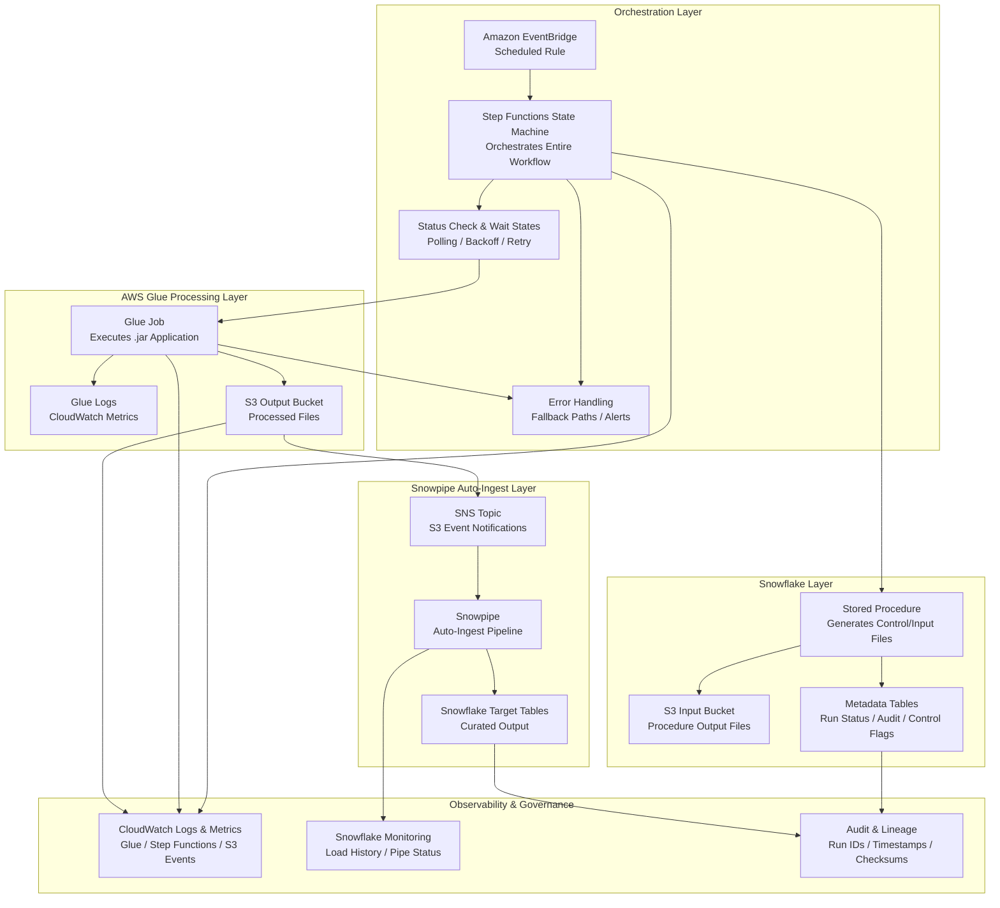

📌 Overview

This project implements an event‑driven, fully automated data processing pipeline integrating AWS services with Snowflake to deliver a scalable, resilient, and production‑ready ingestion framework.

The workflow begins with AWS‑based triggers that invoke Snowflake stored procedures, which generate input files and land them in an S3 bucket. These files serve as the control inputs for an AWS Glue job, orchestrated through AWS Step Functions and scheduled using Amazon EventBridge. Glue executes a custom .jar application, processes the input payloads, and writes enriched output files back into a designated S3 location.

An SNS topic is configured to listen for new output files and automatically notifies Snowpipe, enabling auto‑ingest into Snowflake target tables with minimal latency. This architecture demonstrates strong command of serverless orchestration, event‑based processing, Snowflake integration patterns, and AWS‑native automation, delivering a robust and scalable data pipeline suitable for enterprise workloads.

🏗️ Enterprise Architecture Diagram

