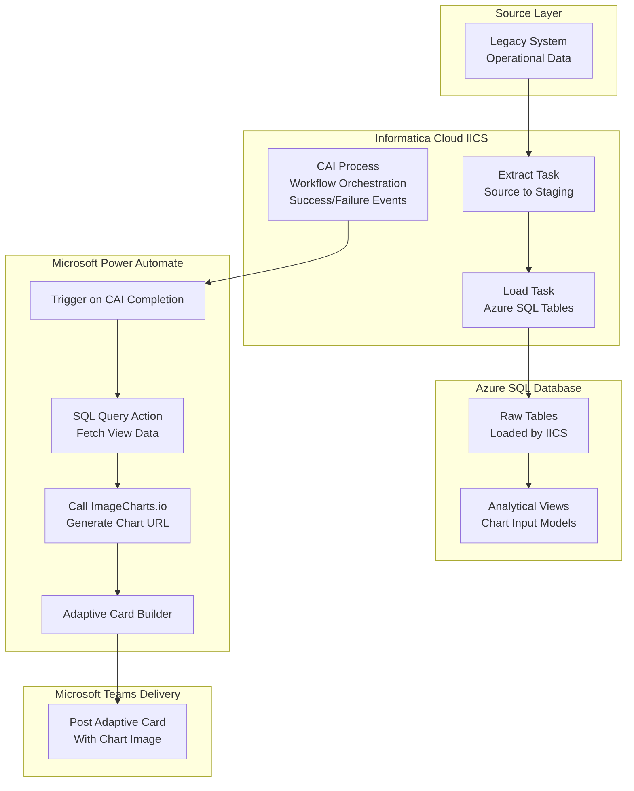

📌 Overview 

This project showcases an end‑to‑end automated reporting and visualization pipeline built using Informatica Cloud, Azure SQL Database, ImageCharts.io, and Microsoft Power Automate (MS Flow).

The solution extracts data from a legacy on‑premise system using Informatica Cloud IICS, loads it into Azure SQL tables, and transforms the data into analytical views optimized for downstream visualization. Once the Informatica CAI workflow completes, it triggers a Power Automate flow, which dynamically calls ImageCharts.io using adaptive cards and SQL view outputs to generate real‑time charts. These charts are then automatically delivered to Microsoft Teams channels for business consumption.

This architecture demonstrates expertise in cloud integration, workflow orchestration, API‑driven visualization, and event‑based automation, enabling a fully hands‑free reporting experience for business stakeholders.

🏗️ Enterprise Architecture Diagram

