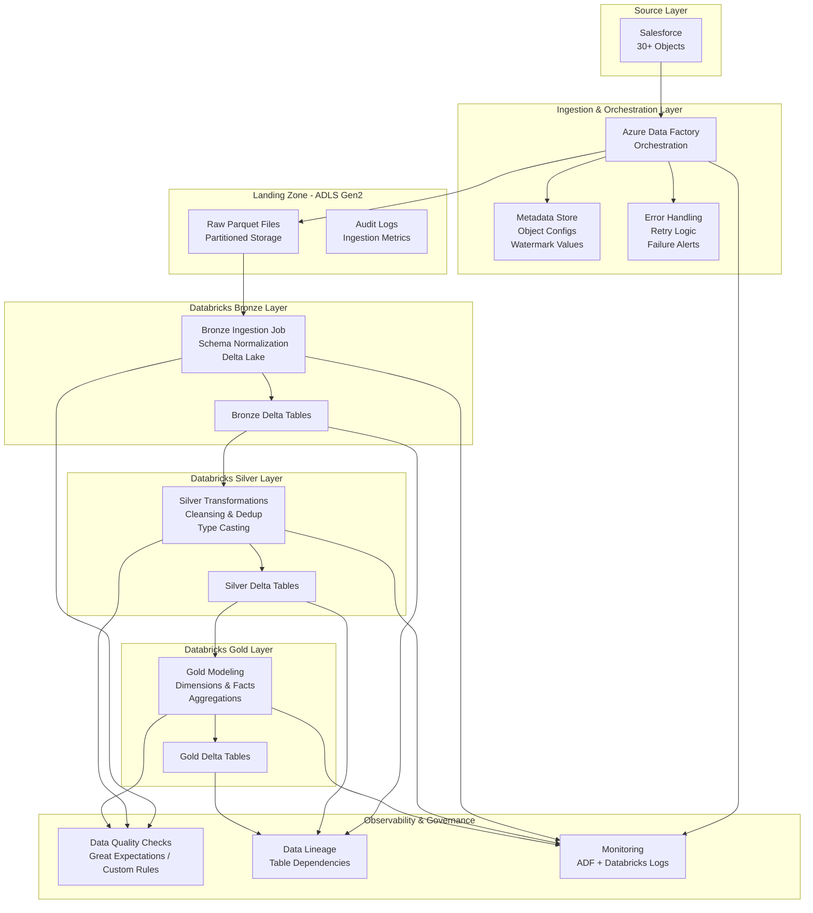

📌 Overview
This project implements a metadata‑driven, incremental ingestion and transformation framework designed to move complex Salesforce datasets into a scalable, governed, and analytics‑ready Delta Lake architecture on Databricks.

The solution orchestrates the extraction of 30+ Salesforce objects using Azure Data Factory, applies dynamic parameterization for object‑specific logic, and lands raw Parquet files into Azure Data Lake Storage Gen2 with enterprise‑grade partitioning, audit logging, and schema drift handling.

From there, Databricks processes the data through the Bronze → Silver → Gold medallion layers, applying robust data quality checks, lineage tracking, and business modeling to deliver trusted, production‑ready datasets for downstream analytics and reporting.

This architecture reflects modern data engineering best practices, including incremental ingestion, Delta Lake ACID guarantees, observability, error‑resilient orchestration, and layer‑aware governance across the entire data lifecycle.

## 🏗️ Enterprise Architecture Diagram (Advanced)

